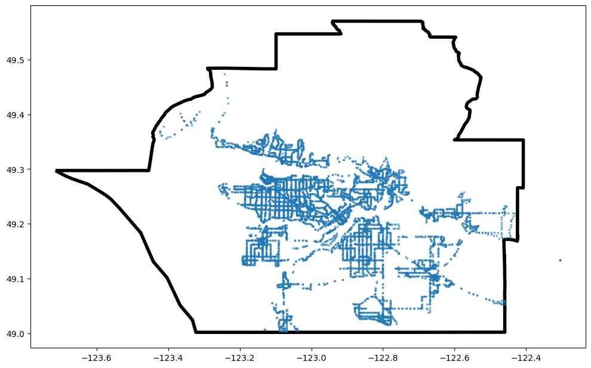
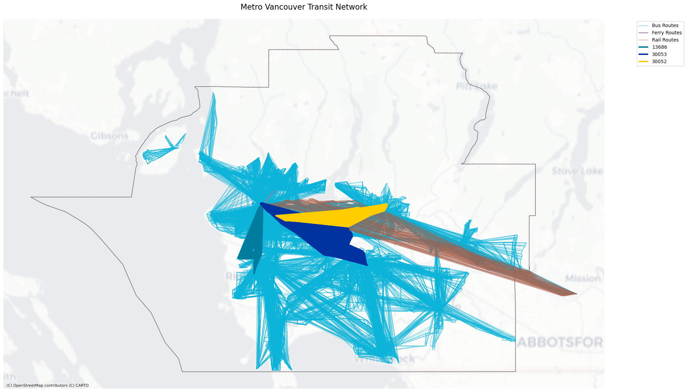

# UrbanTransitIQ

## Overview
This analysis investigates the public transit system in Metro Vancouver by leveraging GTFS (General Transit Feed Specification) data and geospatial information. The study aims to uncover insights into transit coverage, service distribution, and transportation modes, providing actionable recommendations to improve accessibility, efficiency, and equity in the region's transit system.

## Data Integration
The project successfully integrates multiple data sources to create a comprehensive view of Metro Vancouver's transit system:

- **GTFS Data**: Includes detailed information about stops, routes, trips, and schedules
- **Geospatial Data**: Administrative boundaries and route shapes are overlaid for precise spatial analysis

This integration ensures spatial and temporal accuracy, enabling detailed analyses and high-impact visualizations.

## Key Findings

### 1. Transit Coverage by Community
Transit service extends across Metro Vancouver, but with varying density and accessibility:

- **Urban Centers**: Downtown Vancouver, Burnaby, and parts of Surrey exhibit a high density of transit stops, reflecting well-connected hubs with frequent service
- **Suburban and Peripheral Areas**: These regions show lower stop density, highlighting potential gaps in transit infrastructure
- **Coverage Insights**: While urban cores are well-served, peripheral areas could benefit from targeted infrastructure improvements to enhance accessibility and equity

### 2. Transport Types Distribution
Metro Vancouver's transit network comprises a diverse mix of transportation modes:

- **Bus**: The dominant mode, providing extensive coverage across the region
- **SkyTrain (Railway)**: Forms the backbone of the rapid transit network
- **Ferry (SeaBus)**: Provides vital water crossings, connecting North Vancouver to Downtown

### 3. Service Frequency Analysis
A temporal analysis of service schedules reveals clear patterns:

- **Peak Hours**: High-frequency services during commuter periods (7–9 AM and 4–6 PM)
- **Off-Peak Hours**: Reduced service levels during midday and late evenings
- **Key Takeaway**: Prioritizing resource allocation during peak hours while improving off-peak coverage

- 

### 4. Spatial Analysis
Using hexagonal grid analysis, the spatial distribution of transit services reveals:

- **High-Density Zones**: Urban centers show the highest stop and service density
- **Coverage Gaps**: Peripheral and suburban areas exhibit sparse service density
- **Temporal Patterns**: Service levels vary significantly throughout the day

- 

### 5. Transit Network Visualization
A complete visualization of the Metro Vancouver transit network reveals:

- **Modal Connectivity**: Integration of buses, SkyTrain, and ferries creates a cohesive network
- **Service Hierarchy**: SkyTrain lines act as high-speed backbones
- **Key Observations**: Sparse connections near boundary areas need better transit integration

- 

## Analysis Methods

### Comparative Analysis Framework

| Aspect | Transit Network | H3 Grids | Transit Stops |
|--------|----------------|-----------|---------------|
| **Focus** | Route connectivity and type | Density of stops/services | Distribution of individual stops |
| **Granularity** | Network-level overview | Aggregated at hexagonal grids | Stop-level details |
| **Use Case** | Visualizing network structure and corridors | Identifying hotspots and gaps | Foundational mapping of stops |
| **Insights Provided** | Major corridors and overlaps | Density variations across regions | Stop clustering and coverage gaps |

### Application Benefits

1. **Transit Network Analysis**
   - Provides system-wide perspective
   - Highlights connectivity patterns
   - Identifies major transit corridors

2. **H3 Grid Analysis**
   - Enables standardized density comparison
   - Reveals service concentration areas
   - Facilitates gap analysis

3. **Transit Stop Assessment**
   - Offers granular coverage view
   - Supports accessibility analysis
   - Pinpoints specific service locations

### Integration Strategy
- Combine all three methods for comprehensive understanding
- Use network analysis for strategic planning
- Apply H3 grids for density optimization
- Utilize stop data for tactical improvements

## Next Plan
This project sets the stage for further enhancements:

1. **Real-Time Data Integration**: Incorporating GTFS-Realtime feeds
2. **Passenger Flow Analysis**: Combining transit data with passenger flow patterns
3. **Equity Analysis**: Adding demographic and housing data
4. **Interactive Dashboards**: Transitioning to cloud-based solutions

## Conclusion
UrbanTransitIQ offers a comprehensive and data-driven analysis of Metro Vancouver's transit system. By identifying coverage gaps, service patterns, and opportunities for improvement, this project provides actionable insights that can enhance the region's transit accessibility, efficiency, and equity. This work underscores the importance of combining data science and geospatial tools for informed transit planning.